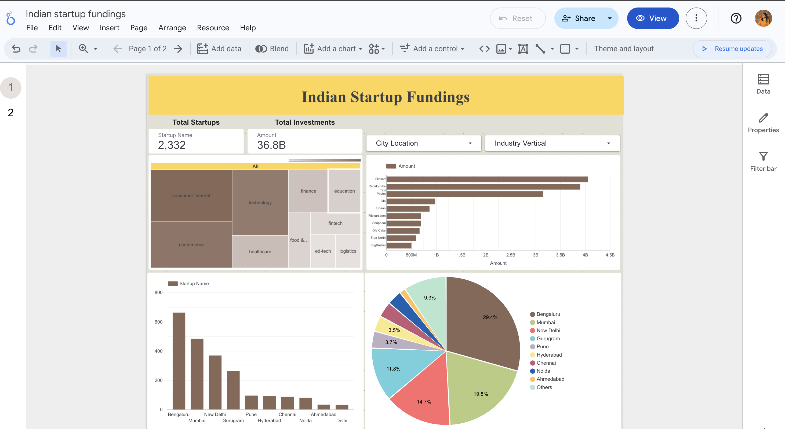

# Startup-Fundings-EDA
Exploratory Data Analysis on Indian Startup Funding Data
This project explores Indian startup funding trends using real-world data, focusing on uncovering insights about startup growth, city-wise funding, popular sectors, and top investors. Visualizations were created using Python (Pandas, Seaborn) and Google Data Studio.

---

## 📂 Dataset

- **Source**: [Kaggle – Startup Funding Dataset](https://www.kaggle.com/datasets/ayushggarg/startup-investments-in-india)
- **Format**: CSV
- **Features Include**:
  - Startup Name
  - City
  - Industry Vertical
  - Investors
  - Funding Amount
  - Date
  - Type of Funding Round

---

## 🔧 Tools & Technologies

- Python, Pandas, NumPy – Data cleaning & preprocessing  
- Matplotlib, Seaborn – Visualization  
- Google Data Studio – Interactive dashboard  
- Jupyter/Colab – Analysis environment  

---

## 📊 Key EDA Questions Answered

- How has funding evolved over the years?
- Which cities attract the most investment?
- What are the most funded sectors?
- Who are the top investors and how often do they invest?
- What types of funding rounds are most common?

---

## 📈 Sample Insights

- 📍 **Bangalore** and **Delhi NCR** dominate the startup scene  
- 📈 Funding peaked around **2015–2017**  
- 💸 Most startups receive **seed or angel** funding  
- 🧠 A few key investors fund a large portion of startups  
- 🏥 Sectors like **E-commerce**, **Fintech**, and **Healthcare** received the highest funding

📊 Google Data Studio Dashboard
[🔗 Click to View the Dashboard](https://lookerstudio.google.com/u/0/reporting/e15eba51-6f04-4545-9918-49671205dfef/page/3NVSF/edit)

This dashboard visualizes key insights from the Indian Startup Funding dataset, including:

📅 Year-wise funding trends

🌆 Top startup cities

🏢 Leading sectors & industries

💰 Amounts funded and types of funding rounds

🧠 Top investors and their frequency

Built using Google Data Studio to showcase interactive visualizations for EDA.

